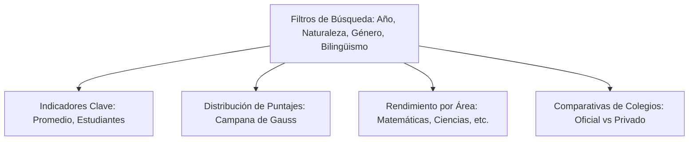

# Manual de Usuario: Plataforma Inteligente Ruta Saber 11

Bienvenido al **Manual de Usuario Oficial** de la plataforma **Ruta Saber 11**. Esta herramienta web de última generación integra modelos de Inteligencia Artificial (CatBoost Regressor) con analítica de datos avanzada para orientar a estudiantes, guiar a docentes, potenciar a instituciones y facilitar la carga anual de datos para el reentrenamiento del modelo en caliente.

> [!NOTE]
> **Filosofía del Proyecto:**
> Esta herramienta no tiene un propósito clasificatorio ni punitivo. Su objetivo primordial es predecir de forma temprana el rendimiento estimado, recomendar recursos de estudio personalizados y ofrecer un panorama estadístico que potencie el aprendizaje individual y grupal.

---

## 1. Módulo del Estudiante: Tu Camino al Éxito

El panel del estudiante está diseñado para motivar el autoaprendizaje, diagnosticar fortalezas y debilidades y estructurar una ruta diaria de mejora.

### A. Onboarding Predictivo (Predicción de Puntaje con IA)
Al ingresar por primera vez, el estudiante completa un breve formulario demográfico y socioeconómico. 
1. **Completar datos:** Ingresa datos como estrato residencial, nivel educativo de los padres, acceso a herramientas digitales (computador, internet), naturaleza de tu colegio y promedio escolar de tu colegio.
2. **Generación del Reporte:** Al hacer clic en **"Predecir Puntaje"**, el motor de IA evalúa tus características y calcula una **Proyección Estimada** (escala de 0 a 500 puntos).
3. **Persistencia:** Tu puntaje proyectado quedará guardado localmente y se mostrará en una tarjeta flotante en la barra lateral para guiar tu navegación.

### B. Mapa de Aprendizaje y Mi Ruta
* **Mapa de Aprendizaje:** Representa las 5 áreas evaluadas en el Saber 11 (Matemáticas, Lectura Crítica, Ciencias Naturales, Sociales y Ciudadanas, e Inglés). Cada área cuenta con un porcentaje de dominio.
* **Mi Ruta:** Un itinerario de estudio personalizado basado en tu puntaje proyectado. Te recomendará lecturas, videos educativos y ejercicios de práctica enfocados en tus áreas de oportunidad.

### C. Centro de Retos y Hábitos de Estudio
* **Reto Diario:** Una pregunta tipo ICFES seleccionada al azar cada día. Al responderla, recibirás retroalimentación inmediata sobre la opción correcta.
* **Hábitos de Estudio:** Un checklist interactivo diario para marcar tus rutinas (ej. "Estudié 30 minutos", "Leí una columna de opinión", "Practiqué inglés"). Mantener una racha incrementa tus logros en la plataforma.

---

## 2. Módulo del Docente: Monitoreo y Pedagogía

El docente cuenta con un panel analítico y recursos pedagógicos para liderar a sus grupos hacia la excelencia académica.

### A. Panorama General (Dashboard Regional)
Este panel ofrece una vista interactiva de los datos históricos consolidados (por defecto de Bogotá).



* **Filtros Dinámicos:** Puedes segmentar los datos por año (ej. 2017, 2018), género (F/M), naturaleza del colegio (Oficial/No Oficial) y jornada.
* **Campana de Gauss (Histograma):** Muestra de manera visual la frecuencia de estudiantes en rangos de 20 puntos, permitiendo identificar la dispersión del rendimiento en la región.
* **Promedio por Áreas:** Tarjetas estadísticas que detallan las medias en cada asignatura evaluada.

### B. Panel Docente y Orientación
* **Panel Docente:** Permite dar seguimiento al avance de tus grupos, registrar nuevos simulacros y asignar rutas de lectura o cuestionarios específicos.
* **Guía de Orientación:** Fichas y sugerencias didácticas listas para descargar y aplicar directamente en las clases de fortalecimiento.

---

## 3. Módulo Institucional: Visión de Directivos

Diseñado para directores de colegios y administradores que requieren analizar el rendimiento general del establecimiento.

### A. Comparación por Jornadas
Muestra una comparativa del puntaje promedio, total de estudiantes y mejora semestral en las distintas jornadas de la institución (Mañana, Tarde, Completa).

| Jornada | Estudiantes Activos | Puntaje Promedio | Desviación / Mejora |
| :--- | :---: | :---: | :---: |
| **Jornada Completa** | 120 | 310 pts | +12% |
| **Jornada Mañana** | 450 | 285 pts | +8% |
| **Jornada Tarde** | 380 | 272 pts | +5% |

### B. Comparativa Nacional
Un gráfico de barras horizontales superpuestas muestra el promedio porcentual de aciertos de tu institución contra la media nacional en las 5 materias críticas, facilitando la toma de decisiones presupuestarias y pedagógicas.

---

## 4. Manual de Carga de Archivos y Reentrenamiento Anual

Este módulo administrativo permite actualizar anualmente la base de datos histórica (`bogota_data.csv`) y reajustar los pesos de predicción del modelo CatBoost de forma segura, en caliente y en tiempo real.

> [!IMPORTANT]
> **Acceso Restringido:**
> Este apartado está reservado exclusivamente para administradores del sistema y directivos con rol de gestión de base de datos. Se localiza en la barra lateral bajo la opción **"Actualización Anual"** (icono de recarga `RefreshCw`).

### Paso 1: Preparación de tu Archivo CSV
Antes de subir tu archivo, asegúrate de que cumpla estrictamente con la estructura esperada. Puedes descargar una plantilla de referencia haciendo clic en el botón **"Descargar Plantilla CSV"** dentro de la pestaña de especificaciones en la página.

#### Cabeceras críticas requeridas en el archivo:
1. `PUNT_GLOBAL` *(Numérico 0-500)*: Puntaje global del estudiante. **Crítico para entrenar el modelo.**
2. `COLE_DEPTO_UBICACION` *(Texto)*: Departamento del colegio. Se utiliza para filtrar los datos y extraer la sub-base de Bogotá.
3. `ESTU_GENERO` *(Texto: "F" / "M")*: Género del alumno.
4. `FAMI_ESTRATOVIVIENDA` *(Texto: Ej. "Estrato 2")*: Estrato socioeconómico residencial.
5. `COLE_COD_DANE_ESTABLECIMIENTO` *(Numérico)*: Código DANE para agrupar promedios de colegios.
6. `COLE_NATURALEZA` *(Texto: "OFICIAL" / "NO OFICIAL")*: Tipo de administración.
7. `FAMI_TIENECOMPUTADOR` *(Texto: "SI" / "NO")*: Posesión de computadora en el hogar.

> [!TIP]
> **Separadores y Codificación:**
> Asegúrate de guardar tu archivo en formato **CSV delimitado por comas (`,`) o puntos y comas (`;`)** y codificado en **UTF-8** para evitar errores con caracteres especiales (tildes o eñes).

---

### Paso 2: Carga y Validación en Tiempo Real
La interfaz cuenta con un sistema inteligente de escaneo previo antes de la subida:

1. **Arrastrar o Seleccionar:** Suelta tu archivo `.csv` en la zona de arrastre punteada o haz clic para explorar tus archivos en el disco local.
2. **Escaneo Automático:** Una vez seleccionado, el validador en cliente leerá las cabeceras del CSV y mostrará una lista dinámica:
   * **Badge `presente` (Verde con Check):** La columna crítica está lista y bien deletreada.
   * **Badge `faltante` (Rojo con X):** Falta una columna requerida. El botón de entrenamiento se deshabilitará hasta que corrijas el archivo.
   * **Badge `opcional` (Gris):** Columnas demográficas secundarias que el modelo imputará automáticamente si no se encuentran.

---

### Paso 3: Monitoreo del Reentrenamiento en Segundo Plano
Una vez que el archivo es validado y haces clic en **"Iniciar Reentrenamiento"**, la plataforma arranca un proceso en segundo plano asíncrono. Puedes monitorear cada paso mediante dos componentes premium:

#### A. El Stepper de Tareas
Muestra en qué punto exacto del pipeline de Python se encuentra la operación:
* **Carga de CSV:** Lectura inicial y validación de peso.
* **Procesamiento e Imputación:** Conversión de valores vacíos y codificación ordinal de educación.
* **Filtro Bogotá:** Extracción de registros de la capital y sobreescritura de `bogota_data.csv` en disco.
* **Entrenamiento CatBoost:** Ajuste de transformadores (`ColumnTransformer`) y entrenamiento de los árboles de decisión simétricos con regularización L2.
* **Despliegue en Vivo:** Recarga dinámica en caliente de los nuevos recursos en memoria.

#### B. Terminal de Logs en Tiempo Real
Un cuadro de consola retro-moderno que imprime en tiempo real los registros detallados de salida de la terminal de Flask, permitiendo un diagnóstico exhaustivo.

```
[15:42:01] Iniciando procesamiento de base de datos...
[15:42:02] Paso 1: Cargando archivo CSV subido...
[15:42:04] CSV cargado exitosamente. Filas totales: 104,820
[15:42:05] Paso 2: Filtrando registros de la región Bogotá...
[15:42:06] Registros de Bogotá filtrados y listos: 13,955
[15:42:07] Base de datos del Dashboard actualizada en caliente (bogota_data.csv)
[15:42:07] Paso 3: Realizando ingeniería de variables socioeconómicas...
[15:42:09] Paso 4: Calculando rendimiento y promedios por establecimiento...
[15:42:10] Paso 5: Ajustando transformadores numéricos y categóricos...
[15:42:11] Preprocesador ColumnTransformer guardado correctamente.
[15:42:11] Paso 6: Entrenando modelo regresor predictivo CatBoost...
[15:42:22] Entrenamiento completado en 11.40 segundos.
[15:42:22] Métricas obtenidas: RMSE=41.258 | R²=0.8242
[15:42:23] Paso 7: Recargando recursos en caliente en el hilo principal...
[15:42:24] ¡Proceso de actualización anual completado con éxito!
```

---

### Paso 4: Resultados y Despliegue Exitoso
Al finalizar de manera exitosa (progreso = 100%), la consola se ocultará y aparecerá una hermosa **Tarjeta de Resultados de IA**:

* **Registros Actualizados:** Total de estudiantes de Bogotá indexados en la nueva base de datos.
* **Precisión $R^2$:** El coeficiente de determinación obtenido por el nuevo modelo en la base (ej. `82.4%`).
* **Mape RMSE:** Desviación estándar de los residuos (ej. `41.258` puntos).
* **Tiempo de Carga:** Segundos transcurridos en el entrenamiento y recarga (ej. `11.4s`).

Haz clic en **"Ir al Dashboard"** para ver los gráficos interactivos actualizados inmediatamente con los nuevos datos anuales cargados, o en **"Cargar Otro Dataset"** para reiniciar el módulo.
